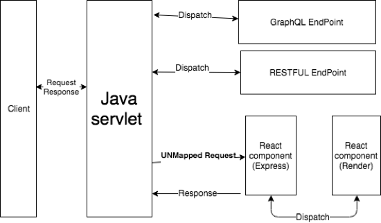
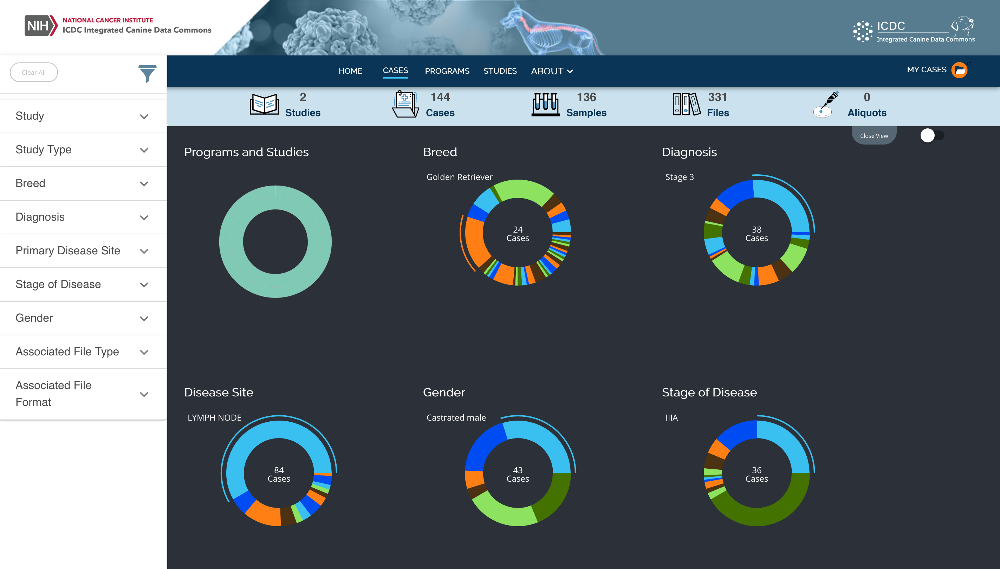
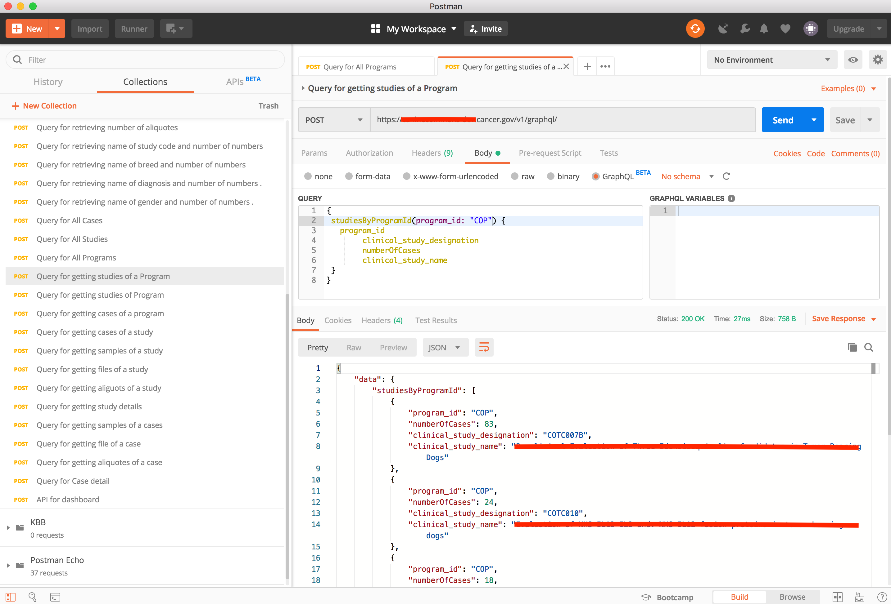

 

#  

The [Integrated Canine Data Commons (ICDC) project](http://caninecommons.cancer.gov/) is a joint project between FNL's ADRD and BIDS Directorates to develop the ICDC for NCI's DCTD group.

The ICDC will  create a new, dynamic data commons for canine cancer data, including not only clinical outcomes and genomics findings from canine clinical trials being conducted by the Comparative Oncology Program (COP) in collaboration with DCTD, but also the trials’ molecular, pharmacological, microenvironment, medical imaging and other study data.

## General Overview and Design Guidelines

ICDC has two layers,Front-end and Back-end. Front-end is written in React.js and back-end follows API design is coded in JAVA.  We put two layers together as a Java application.  The figure above shows how system works and how back-end response the request. 

Client as an API consumer send a request, the JAVA servlet will capture the event and dispatch to the right endpoint. 

Client requests a web page, the JAVA servlet will capture the event and redirect the request to the React Component, React use Express to handle the request and render the HTML to the client.

Back-end provides two types of APIs , GraphQL and REST for purposes. 

## Folder Structure

    .
    ├── doc                      	 		# Documentation files 
    ├── src                     	 				
    │	├── main 			  	 		
    │	│	├── asciidoc			# API document template 
    │	│	├── frontend			# Front end source files
    │	│	├── java/gov/nih/nci/icdc 	# Back end source files
    │	│	├── resource			# configuration files
    │	│	└── webapp			# web html files
    │	└── test				# Test scripts
    ├── mvnw   
    ├── mvnw.cmd  
    ├── pom.xml 			      		# Maven POM file 
    └── README.md

## Set up

* dependencies 

Java SE Development Kit 11 

Tomcat 9

Maven 3.1

Neo4j Server ( Require to install neo4j graphql plugin )

* Configuration 

Change the neo4j.graphql.endpoint point to your Neo4j Server's graphql endpoint.  In the application.properties change the setting:
	
	
	neo4j.graphql.endpoint =https://localhost:7473/graphql/

	 

* Maven Package project into War file. 

Use Maven to build the whole project into War file. Details can be found in POM file.

	mvn package

* Deploy war file to the tomcat

## Front End

After deploy to the tomcat, should able to see the page like this. 

 -
 

## GraphQL Endpoint

The Graphql endpoints have three components: domain, version and query.

	https://domain/<version>/graphql/ 

* Domain

Website URL

* Version

 API's  version ( v1 as version 1) 

* Query

GrapQL query denotes the data wanted. 

Example query:
	
	# get studies by program id
	{
	 studiesByProgramId(program_id: "COP") {
	    program_id
        clinical_study_designation
        numberOfCases
        clinical_study_name
        }
     }

ICDC only support http <b>POST</b> method for GraphQL Endpoint. 

The picture below shows how to use POSTMAN to query the GraphQL. 

-

## REST Endpoint

The Graphql endpoints have three components: domain, version and query.

The formate looks like below:

	https://domain/<version>/rest/<query>

Example query:

	https://domain/v1/rest/programs

