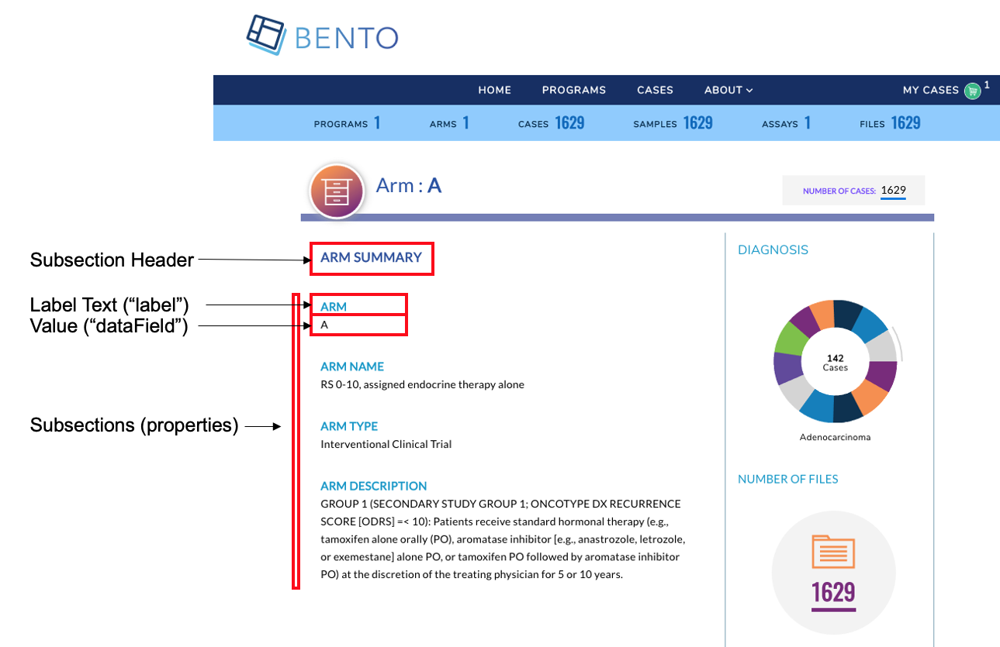

# Arm  Detail Page
The Arm Detail Page provides a summary of a Study/Project/Arm of that belongs to a Program that participates in your data sharing platform.


**Arm Detail Page**. Displayed are the configurable components of the Arm Detail Page.

### Prerequisites
1. The files that specify the configuration parameters of the Arm Detail Page are stored in the GitHub `https://github.com/CBIIT/bento-frontend` (representing your GitHub username as `YOUR-USERNAME`). Create a local clone of your fork into a local directory, represented in these instructions as `$(src)`.

2. Configuration Parameters for all Arm Detail Page elements can be specified in the file: `$(src)/bento-frontend/blob/master/src/bento/armDetailData.js`.

3. All images and icons that you use in your Bento instance should be accessible via a public url. 

4. Please review the list of [GraphQL queries](https://github.com/CBIIT/bento-backend/blob/master/src/main/resources/graphql/bento-extended-doc.graphql) to select query type(s) that return your data of interest.

### Configuring the Arm Detail Page.
The Arm Detail Page allows you to add key arm attributes as label value pairs within a set of subsections(See Step 3. below). A maximum of **6** sections can be added to the Arm Detail Page. Within each subsection a maximum of **10** attributes can be displayed as label:value pairs. 
<br>If more than 6 subsections are configured, **only the first 6 subsections will be displayed in the UI, other subsections will be ignored**. 
<br>If more than 10 properties are configured, **only first 10 properties will be displayed in the UI, other properties will be ignored**.
<br> The Arm Detail Page also allows you to add an optional table to list Arm level entities.

1. Open the file `$(src)/src/bento/armDetailData.js`.
2. Under `header`:
	* Set the field `label` to the display label for your Arm Detail Page.
	* Set the field `dataField` to the GraphQL API query that returns the value, such as the Arm Name or Arm ID that you want to display.
3. Under `subsections`:
	* For each label:value pair that you wish to display, create a object {label: ,datafield: ,} in `properties`:
        * Set the field `label` to the display label for your attribute.
        * Set the field `dataField` to the GraphQL API query that returns the data to be displayed as value for the given label:value pair.
		* You can embed an optional link in your label or your value, or both. Links can be internal or external. 
			* To add a link to your *value* specify an internal or external link by adding a `link` attribute to your object. 
			* To add a link to your *label* specify an internal or external link by adding a `labelLink` attribute to your object.
    * Add the GraphQL API query field to `GET_ARM_DETAIL_DATA_QUERY`. 

### Configuring the Arm Detail Page Table.
You can add a table to the Arm Detail Page. *This is optional.*
1. Open `$(src)/bento-frontend/src/bento/programDetailData.js`.
2. In `table`:
  * The `display` field is set to true, by default. *Set this field to false if you do not wish to display a table in the Arm Detail Page*.
  * Set the field `title` to the the title of your table.
  * Set the field `dataField` to the name of the GraphQL API query being used to return data for the Arm Detail Page. *Note: This query should match the GraphQL API query in `GET_ARM_DETAIL_DATA_QUERY`*.
  * Set the field `defaultSortField` to the name of the query field that will be used to sort the Arm Detail Page Table. Note: this query field should be displayed as one of the columns in the Arm Detail Page Table.
  * Set the field `defaultSortDirection` to the sort order of your choice. Valid values are 'asc' (ascending) and 'desc' (descending).
  * Add your GraphQL API query to `GET_ARM_DETAIL_DATA_QUERY`.
3. Example:

```javascript
...
const table = {
  display: true,
  title: '<Table Title>',
  dataField: '<GraphQL API query returning data for this page.>',
  defaultSortField: '<GraphQL API query field used to sort the table.>',
  defaultSortDirection: '<sort order, asc|desc>',
 ...
const GET_ARM_DETAIL_DATA_QUERY = gql`{
  '<Your GraphQL query>'' {
    '<Data fields returned by your GraphQL API query>'
  ... 
 }
}
```

### Adding columns to the Arm Detail Page Table.
You can add up to 10 columns in the Arm Detail Page Table. If you add more than 10 columns, **Bento will display the first 10 columns without an error or warning message**. The top-down order of columns will be displayed left to right on the UI.

1. Open `$(src)/bento-frontend/src/bento/programDetailData.js`.
2. Under `table`, add an object `{dataField: , header: , link: ,}` to the `columns` list:
  * Set the field `dataField` to the GraphQL API query data field that returns the data for the column.
  * Set the field `header` to the column header name.
  * Set the field `link` to an internal or external link that is to be embedded into the the column value. See below for additional instructions on adding internal and external links. *Links are optional*.
  * Add your GraphQL API query data field to `GET_ARM_DETAIL_DATA_QUERY`.
3. Example:

```javascript
const table = {
  ...
  columns: [
    {
      dataField: '<GraphQL API query field returning data for this column>',
      header: '<Column Header>',
      link: '<link to be embedded in column value>',
    },
    {
      dataField: '<GraphQL API query field returning data for this column>',
      header: 'PubMed ID',
    },
    ...
  ],
};

const GET_ARM_DETAIL_DATA_QUERY = gql`{
  '<Your GraphQL query>'' {
    '<Data fields returned by your GraphQL API query>'
  ... 
 }
}
```
#### Internal Links in the Arm Detail Page Table.
1. links starting with '/' are considered as internal links.
2. Internal links shall be opened in the same tab.
3. Dynamic links can be generated by passing a valid table field to '{}'. For example, '/program/{program_id}' shall link to 'program/NCT00310180'.

#### External Links in the Arm Detail Page Table.
1. External links shall start with 'http://' or'https://'.
2. External links shall show-up with 'externalLinkIcon'. Note: In this version of Bento the External Link Icon of the Arm Detail Page is not configurable.
3. External link shall be opened in a new tab.
4. Dynamic links can be generated by passing a valid table filed to '{}'. 
   For example, 'https://pubmed.ncbi.nlm.nih.gov/{pubmed_id}' shall link to 'https://pubmed.ncbi.nlm.nih.gov/29860917/'.
