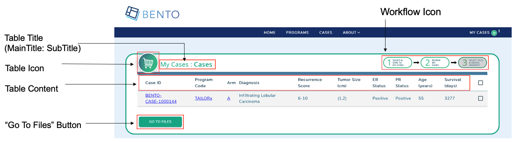
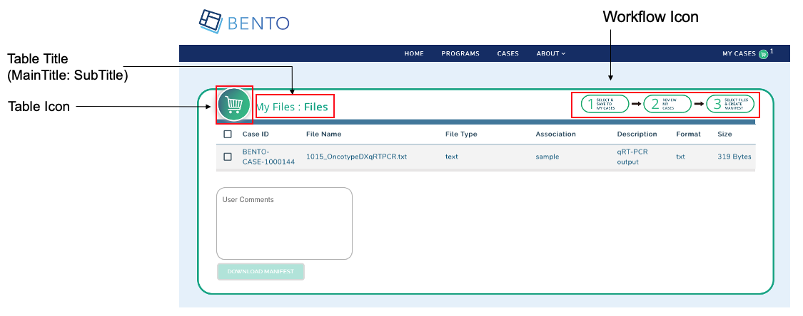
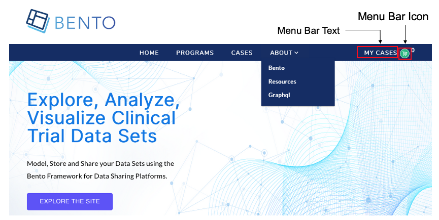
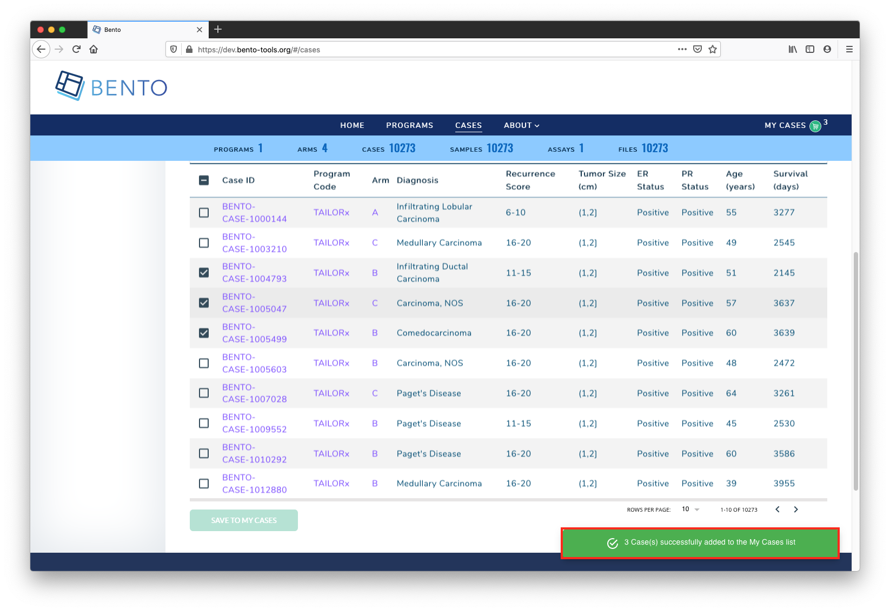

# Cart Workflow

## Introduction
The cart workflow is a mechanism for users to generate a manifest for working with case files.

<p>&nbsp;</p>

## Prerequisites
1. Fork the GitHub repo `https://github.com/CBIIT/bento-frontend` (representing your GitHub username as `YOUR-USERNAME`)
2. Create a local clone of your fork into a local directory, represented here as `$(src)`.

<p>&nbsp;</p>

## Configuring the Cases page in the Cart Workflow 




### Cases Page: Table Title
To configure the table title on the page (right above the table)

#### Edit configuration file
1. Edit `$(src)/bento-frontend/src/bento/cartWorkflowData.js` with the editor of your choice
2. Under `myCasesPageData`, 
    1. set the field `myCasesMainTitle` to have the desired title for the page
    2. set the field `myCasesSubTitle` to have the desired subtitle 
3. For example, to have the page appear as 'My Subjects: Subjects' instead of 'My Cases: Cases' (with 'My Cases' being the title):

```javascript
export const myCasesPageData = {
  myCasesMainTitle: 'My Subjects :',
  myCasesSubTitle: 'Subjects',
```

### Cases Page: Table Content
To configure the table on the "My Cases" page

#### Edit configuration file
1. Edit `$(src)/bento-frontend/src/bento/cartWorkflowData.js` with the editor of your choice
2. Under `GET_MY_CASES_DATA_QUERY`, set graphql query ...

### Cases Page: Table Icon
To configure the Table Icon for the "My Cases" page

### Cases Page: Add Icon
1. add icon file to appropriate file location: `$(src)/bento-frontend/src/assets/icons/`
2. add and commit file to repo; then push the commit to github

#### Edit configuration file
1. Edit `$(src)/bento-frontend/src/bento/cartWorkflowData.js` with the editor of your choice
2. Under ` myCasesPageData`, 
    1. set the field `headerIconSrc` to point to the new desired image file
    2. Update the field `headerIconAlt` to an appropriate "alternate text" description for the icon
3. For example:

```javascript
export const myCasesPageData = {
  ...
  headerIconSrc: 'https://raw.githubusercontent.com/YOUR-USERNAME/bento-frontend/master/src/assets/icons/NewIcon.svg',
  headerIconAlt: 'NewIcon logo',
```

### Cases Page: "Go To Files" Button
To configure the Configure "Go To Files" Button* for the "Shopping Cart/My Cases" workflow

#### Edit configuration file
1. Edit `$(src)/bento-frontend/src/bento/cartWorkflowData.js` with the editor of your choice
2. Under `myCasesPageData`, set the field `buttonText` to have the desired text value
3. For example, to have the link appear as 'Go To Files Page' instead of 'GO TO FILES':

```javascript
export const myCasesPageData = {
  ...
  buttonText: 'Go To Files Page',
```

### Cases Page: Workflow Icon
To configure the Workflow Icon for the "Shopping Cart/My Cases" workflow

#### Add Icon file to repo
1. add icon file to appropriate file location: `$(src)/bento-frontend/src/assets/icons/`
2. add and commit file to repo; then push the commit to github

#### Edit configuration file
1. Edit `$(src)/bento-frontend/src/bento/cartWorkflowData.js` with the editor of your choice
2. Under `myCasesPageData`, set the field `cartLabel` to have the desired text value
    1. Set the field `  wizardIconSrc` to point to the new desired image file
    2. Update the field `wizardIconAlt` to an appropriate "alternate text" description for the icon; 
3. For example, to have the icon to use the file `MyWizardIcon.svg` instead of file `MyCases-Wizard-Step2.svg`

```javascript
export const myCasesPageData = {
  ...  
  wizardIconSrc: 'https://raw.githubusercontent.com/YOUR-USERNAME/bento-frontend/master/src/assets/icons/MyWizardIcon.svg',
  wizardIconAlt: 'Go To Step 2',
};
```
<p>&nbsp;</p>

## Configuring Files Page in Cart Workflow



### Files Page: Table Title
To configure the table title on the page (right above the table)

#### Edit configuration file
1. Edit `$(src)/bento-frontend/src/bento/cartWorkflowData.js` with the editor of your choice
2. Under `myFilesPageData`, 
    1. set the field `myFilesMainTitle` to have the desired title for the page
    2. set the field `myFilesSubTitle` to have the desired subtitle 
3. For example, to have the page appear as 'My Subjects: Files' instead of 'My Files: Files':

```javascript
export const myFilesPageData = {
  myFilesMainTitle: 'My Subjects :',
  myFilesSubTitle: 'Files',
```

### Files Page: Table Icon
To configure the Table Icon for the "My Files" page

#### Add Icon file to repo
1. add icon file to appropriate file location: `$(src)/bento-frontend/src/assets/icons/`
2. add and commit file to repo; then push the commit to github

#### Edit configuration file
1. Edit `$(src)/bento-frontend/src/bento/cartWorkflowData.js` with the editor of your choice
2. Under ` myFilesPageData`, 
    1. set the field `headerIconSrc` to point to the new desired image file
    2. Update the field `headerIconAlt` to an appropriate "alternate text" description for the icon
3. For example:

```javascript
export const myFilesPageData = {
  ...
  headerIconSrc: 'https://raw.githubusercontent.com/YOUR_USERNAME/bento-frontend/master/src/assets/icons/NewIcon.svg',
  headerIconAlt: 'NewIcon logo',
```


### Files Page: Workflow Icon
To configure the Workflow Icon for the Files Page in the "Shopping Cart/My Cases" workflow


#### Add an Icon
1. add icon file to appropriate file location: `$(src)/bento-frontend/src/assets/icons/`
2. add and commit file to repo; then push the commit to github

#### Edit configuration file

1. Edit `$(src)/bento-frontend/src/bento/cartWorkflowData.js` with the editor of your choice
2. Under `myFilesPageData`, set the field `cartLabel` to have the desired text value
    1. Set the field `  wizardIconSrc` to point to the new desired image file
    2. Update the field `wizardIconAlt` to an appropriate "alternate text" description for the icon; it is recommended to use underscores instead of spaces with this field
3. For example, to have the icon to use the file `MyWizardIcon.svg` instead of file `MyCases-Wizard-Step2.svg`

```javascript
export const myFilesPageData = {
  ...  
  wizardIconSrc: 'https://raw.githubusercontent.com/YOUR_USERNAME/bento-frontend/master/src/assets/icons/MyWizardIcon.svg',
  wizardIconAlt: 'Go To Step 2',
};
```


### Files Page: File Manifest Name
To configure the File Manifest Name for "Shopping Cart/My Cases" workflow


#### Edit configuration file

1. Edit `$(src)/bento-frontend/src/bento/cartWorkflowData.js` with the editor of your choice
2. Under `myFilesPageData`, set the field `manifestFileName`: to have the desired file value
3. For example, to use the name "File Manifest" instead of `BENTO File Manifest`

```javascript
export const myFilesPageData = {
  ...  
  manifestFileName: 'File Manifest',
  ...
};
```

<p>&nbsp;</p>


## Configuring the Menu Bar for the Cart Workflow



### Menu Bar Text
To configure the link that appears on the menu bar:

#### Edit configuration file
1. Edit `$(src)/bento-frontend/src/bento/cartWorkflowData.js` with the editor of your choice
2. Under `navarBarCartData`, set the field `cartLabel` to have the desired text value
3. For example, to have the link appear as 'MY SUBJECTS' instead of 'MY CASES':

```javascript
export const navBarCartData = {
  cartLabel: 'MY SUBJECTS',
```


### Menu Bar Icon
To configure the icon that appears on the menu bar:

#### Add Icon file to repo
1. Add icon file to appropriate file location: `$(src)/bento-frontend/src/assets/icons/`
2. Add and commit file to your repo; then push the commit to github

#### Edit configuration file
1. Edit `$(src)/bento-frontend/src/bento/cartWorkflowData.js` with the editor of your choice
2. Under `navarBarCartData`, 
    1. set the field `cartIcon` to point to the new desired image file
    2. Update the field `cartIconAlt` to an appropriate "alternate text" description for the icon
3. For example, to have the icon to use the file `MyIcon.svg` instead of file `Icon-MyCases.svg`

```javascript
export const navBarCartData = {
  ...
  cartIcon: 'https://raw.githubusercontent.com/YOUR-USERNAME/bento-frontend/master/src/assets/icons/MyIcon.svg',
  cartIconAlt: 'my_icon_logo',
};
```


<p>&nbsp;</p>


## Configuring Notifications for Cart Workflow 




### Notification text/messages when adding cases to Cart

#### Edit configuration file
1. Edit `$(src)/bento-frontend/src/bento/cartWorkflowData.js` with the editor of your choice
2. Under `cartSelectionMessages`, set the field `selectionsAddedMessage` to have the desired message
3. For example, 

```javascript
export const cartSelectionMessages = {
  selectionsAddedMessage: 'DONE: successfully added to the  list',
  ...
};
```

### Notification text/messages when removing cases from Cart

#### Edit configuration file
1. Edit `$(src)/bento-frontend/src/bento/cartWorkflowData.js` with the editor of your choice
2. Under `cartSelectionMessages`, set the field `selectionsRemovedMessage` to have the desired message
3. For example, 

```javascript
export const cartSelectionMessages = {
  ...
  selectionsRemovedMessage: 'DONE: successfully removed from the list',
};
```
