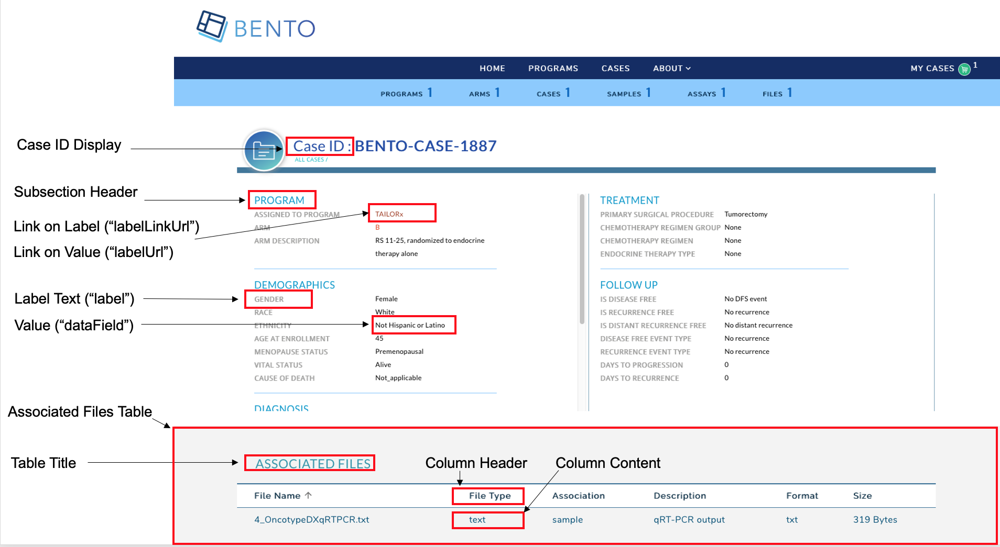

# Case Detail Page
The Case Detail Page lists the key attributes of a case or study subject participating in a clinical study or research program in your data sharing platform.


**Case Detail Page.** Displayed are the configurable components of a Case Detail Page.

### Prerequisites
1. The files that specify the configuration parameters of the Case Detail Page are stored in the GitHub `https://github.com/CBIIT/bento-frontend` (representing your GitHub username as `YOUR-USERNAME`). Create a local clone of your fork into a local directory, represented in these instructions as `$(src)`.

2. Configuration Parameters for all Case Detail Page elements can be specified in the file: `$(src)/bento-frontend/blob/master/src/bento/caseDetailData.js`.

3. All images and icons that you use in your Bento instance should be accessible via a public url. 

4. Please review the list of [GraphQL queries](https://github.com/CBIIT/bento-backend/blob/master/src/main/resources/graphql/bento-extended-doc.graphql) to select query type(s) that return your data of interest.

## Configuring the Case Detail Page.
The Case Detail Page allows you to add key case attributes as label:value pairs within a set of subsections. A maximum of **6** sections can be added to the Case Detail Page; **3** in the Left Hand Panel and **3** in the Right Hand Panel. Within each subsection a maximum of **10** attributes can be displayed as label:value pairs. 
<br>If more than 3 subsections are configured in a panel, **only the first 3 subsections will be displayed in the UI, other subsections will be ignored**. 
<br>If more than 10 properties are configured, **only first 10 properties will be displayed in the UI, other properties will be ignored**.
<br> The Case Detail Page also allows you to add an optional table to list case level data.

### Configuring the Case Detail Page Header
The Case Detail Page Header displays the Case ID. 

1. Open the file `$(src)/bento-frontend/blob/master/src/bento/caseDetailData.js`.
2. Under `caseHeader`:
	* Set the field `label` to the label text to be displayed.
	* Set the field `dataField` to the GraphQL API query field that returns the case id.
	* Add the GraphQL API query field to `GET_CASE_DETAIL_DATA_QUERY`.  

### Configuring the Left and Right Hand Panels of Case Detail Page
The Left and Right Hand Panels allow for the display of case attributes as label:value pairs with a set of subsections; related data attributes can be grouped together in a section.

1. Open the file `$(src)/bento-frontend/blob/master/src/bento/caseDetailData.js`.
2. Under the appropriate section `leftPanel` or `rightPanel`:
	* Add a object {sectionHeader: , secitionDesc: properties: } to add a subsection.
	* Set the field `sectionHeader` to the display name for the subsection.
	* Set the field `sectionDesc` to an optional description for your subsection.
	* Add an object {label:,dataField: ,link: ,labellink: } to add a label:value pair to the subsection.
	 * Set the field `label` to the label name to be displayed.
	 * Set the field `dataField` to the GraphQL API query that returns the value to be displayed.
	 * You can embed an optional link in your label or your value, or both. Links can be internal or external. 
			* To add a link to your *value* specify an internal or external link by adding a `link` attribute to your object. 
			* To add a link to your *label* specify an internal or external link by adding a `labelLink` attribute to your object.
    * Add the GraphQL API query field to `GET_CASE_DETAIL_DATA_QUERY`. 
3. Example of adding a subsection to the Left Hand Panel:

```javascript
...
const leftPanel = [
  {
    sectionHeader: '<Your Subsection Header Title>',
    sectionDesc: '< Your Subsection description.>',
    properties: [
      {
        label: '<Display Label>',
        dataField: '<GraphQL API query field that returns value>',
        link: '<An internal or external link to be added to your value>',
      },
      {
        label: '<Display Label>',
        dataField: '<GraphQL API query field that returns value>',
        labelLink: '<An internal or external link to be added to your label>',
      },
      ...
      ]
  }
  ...
 ]

 const GET_CASE_DETAIL_DATA_QUERY = gql`
 <Your GraphQL API query fields>
 `
```

##### Internal Links to Labels and Values
1. links starting with '/' are considered as internal links
2. Internal links shall be opened in the same tab.
3. Dynamic links can be generated by passing a valid table filed to '{}'. For example, '/arm/{study_acronym}' shall link to 'arm/A'

##### External Links to Labels and Values
1. External links shall start with 'http://' or'https://'
2. External links shall show-up with 'externalLinkIcon' . In this version of Bento, the External Link Icon can be configured by the custodian.
3. External link shall be opened in a new tab.
4. Dynamic links can be generated by passing a valid table filed to '{}'. For example, 'https://pubmed.ncbi.nlm.nih.gov/{pubmed_id}' shall link to 'https://pubmed.ncbi.nlm.nih.gov/29860917/'

## The Case Detail Page Table
The Case Detail Page table can be used to display case-level information such as the files that belong to a case.

### Configuring the Case Detail Page Table.
1. Open `$(src)/bento-frontend/src/bento/caseDetailData.js`.
2. In `table`:
  * The `display` field is set to true, by default. *Set this field to false if you do not wish to display a table in the Case Detail Page*.
  * Set the field `title` to the the title of your table.
  * Set the field `dataField` to the name of the GraphQL API query being used to return data for the Case Detail Page. *Note: This query should match the GraphQL API query in `GET_CASE_DETAIL_DATA_QUERY`*.
  * Set the field `defaultSortField` to the name of the query field that will be used to sort the Case Detail Page Table. Note: this query field should be displayed as one of the columns in the Case Detail Page Table.
  * Set the field `defaultSortDirection` to the sort order of your choice. Valid values are 'asc' (ascending) and 'desc' (descending).
  * Add your GraphQL API query to `GET_CASE_DETAIL_DATA_QUERY`.
3. Example:

```javascript
...
const table = {
  display: true,
  title: '<Table Title>',
  dataField: '<GraphQL API query returning data for this page.>',
  defaultSortField: '<GraphQL API query field used to sort the table.>',
  defaultSortDirection: '<sort order, asc|desc>',
 ...
const GET_CASE_DETAIL_DATA_QUERY = gql`{
  '<Your GraphQL query>'' {
    '<Data fields returned by your GraphQL API query>'
  ... 
 }
}
```

### Adding columns to the Case Detail Page Table.
You can add up to 10 columns in the Case Detail Page Table. If you add more than 10 columns, **Bento will display the first 10 columns without an error or warning message**. The top-down order of columns will be displayed left to right on the UI.

1. Open `$(src)/bento-frontend/src/bento/caseDetailData.js`.
2. Under `table`, add an object `{dataField: , header: , link: ,}` to the `columns` list:
  * Set the field `dataField` to the GraphQL API query data field that returns the data for the column.
  * Set the field `header` to the column header name.
  * Set the field `link` to an internal or external link that is to be embedded into the the column value. See below for additional instructions on adding internal and external links. *Links are optional*.
  * Add your GraphQL API query data field to `GET_PROGRAM_DETAIL_QUERY`.
3. Example:

```javascript
const table = {
  ...
  columns: [
    {
      dataField: '<GraphQL API query field returning data for this column>',
      header: '<Column Header>',
      link: '<link to be embedded in column value>',
    },
    {
      dataField: '<GraphQL API query field returning data for this column>',
      header: 'PubMed ID',
    },
    ...
  ],
};

const GET_CASE_DETAIL_DATA_QUERY = gql`{
  '<Your GraphQL query>'' {
    '<Data fields returned by your GraphQL API query>'
  ... 
 }
}
```

#### Internal Links in the Case Detail Page Table.
1. links starting with '/' are considered as internal links.
2. Internal links shall be opened in the same tab.
3. Dynamic links can be generated by passing a valid table field to '{}'. For example, '/program/{program_id}' shall link to 'program/NCT00310180'.

#### External Links in the Case Detail Page Table.
1. External links shall start with 'http://' or'https://'.
2. External links shall show-up with 'externalLinkIcon'.
3. External link shall be opened in a new tab.
4. Dynamic links can be generated by passing a valid table filed to '{}'. 
   For example, 'https://pubmed.ncbi.nlm.nih.gov/{pubmed_id}' shall link to 'https://pubmed.ncbi.nlm.nih.gov/29860917/'.
