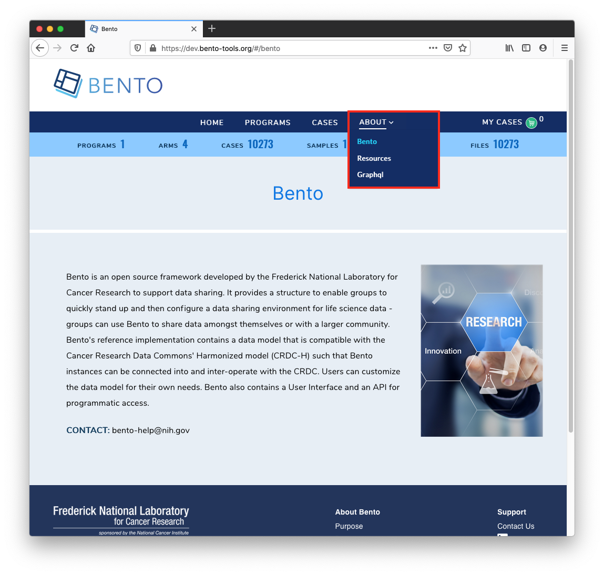

# Static Pages

## Introduction
There are a number of static pages that are available for the Bento framework. These are traditionally available by navigating to the "About" link on the Navigation Bar. In the example below, the static pages are "Bento", "Resources", and "GraphQL".

&nbsp;

## Prerequisites
1. Fork the GitHub repo `https://github.com/CBIIT/bento-frontend` (representing your GitHub username as `YOUR-USERNAME`)
2. Create a local clone of your fork into a local directory, represented here as `$(src)`.

&nbsp;

## Instructions

### Make and Test the local environment changes changes 

1. Edit file: `$(src)/bento-frontend/.env`

2. Change the `REACT_APP_ABOUT_CONTENT_URL` variable to gibberish. One example `REACT_APP_ABOUT_CONTENT_URL= https://raw.githubusercondsdsdstent.com/CBIIT/bento-frontend/master/src/content/prod/aboutPagesContent.yaml`

3. Now edit `$(src)/bento-frontend/src/content/prod/aboutPagesContent.yaml`, and the system will show the changes

### To Create A New Static Page with new Route
1. Edit `$(src)/bento/aboutPagesRoutes.js` add a new path

2. Add a new copy of yaml property to  with page name matching above path

### Edit configuration file
1. There is a maximum of 6 pages that can appear under "About". If no informational pages are configured to be displayed, the "About" menu option will be hidden.

2. To add contents to the 'About' menu, see ["Global Navigation Bar" instructions](configuration/global-ui-elements.html#global-navigation-bar)

3. To edit the title for each page in the 'About' menu: 
   * edit file: `$(src)/aboutPagesContent.yaml` 
   * set the variable `title` to have the title of the page.

4. To set the primary or "hero" image to be tiled onto each page: 
   * edit file: `$(src)/aboutPagesContent.yaml` 
   * set variable `primaryContentImage` with the desired image 
   * NOTE: You cannot use the local file for this you should point to an external image url (e.g. publicly-available, on the internet)

5. To set a secondary image (including, a zoom and scan-around function):
   * Edit `$(src)/aboutPagesContent.yaml`  
   * Add the Field secondaryZoomImage to show up the secondary Image

6. To add content for each page: (including basic formatting of it, i.e. line/paragraph breaks, bold type, hyperlinked text), follow the following syntax guide 
   * Note: The pages need to be in 'YAML' format

| Element                                            | Syntax                                                     | Example                                                      |
| -------------------------------------------------- | ---------------------------------------------------------- | ------------------------------------------------------------ |
| Link or Download  File from externally hosted file | `$$[title](link)$$`                                        | `$$[Cloud Resources](https://datascience.cancer.gov/data-commons/cloud-resources)$$`  (opens in new tab with link-out icon) |
| Bold Title                                         | `$$#text#$$`                                               | `$$#Cloud Resourses#$$`                                      |
| Bold Inline Text                                   | `$$*text*$$`                                               | `$$@CloudResourses@$$`                                       |
| Download Submission PDF                            | `$${Text}$$`                                               | `$${submission guide [PDF]}$$`                               |
| Enhanced Link                                      | `$$[Title](target:[_self] url:[url] type:[Optional] )$$`   | `$$[Testing](target:_self url:/#/developers type:0)$$` (opens in same page without link-out icon) |
| Enhanced Link                                      | `$$[Title](target:[_blank] url:[url] type:[Optional]  )$$` | `$$[Testing](target:_blankurl:/#/developers type:0)$$` (opens in new tab without link-out icon) |

## Best Practices
1. It is recommended to have the title of each page in the 'About' menu match the title on the actual page.
2. The suggested syntax for YAML files is to use 2 spaces for indentation, but YAML will follow whatever indentation system that the individual file uses. In our files we used 2 spaces to represent
