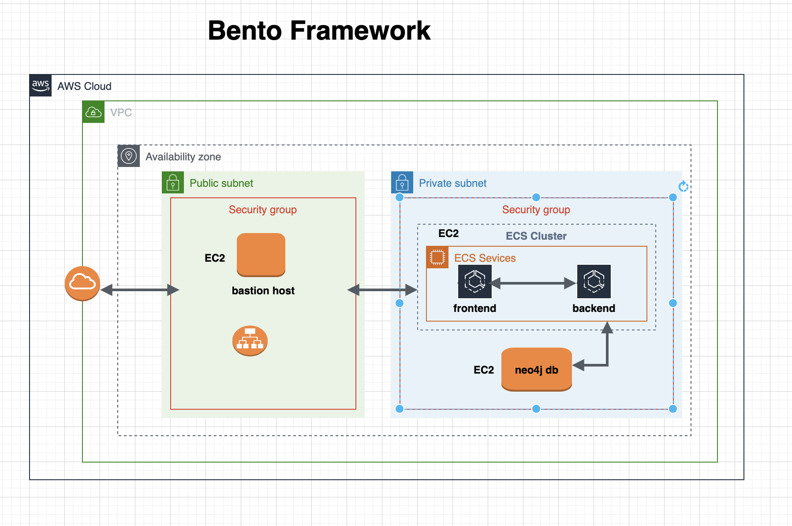
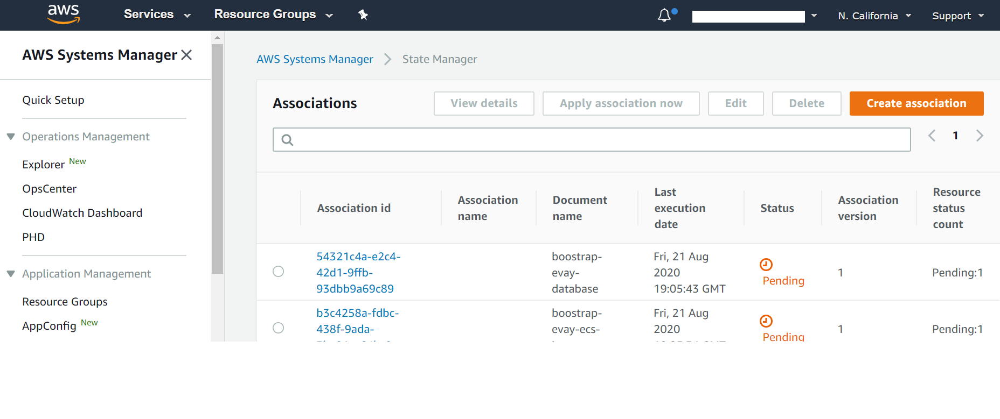
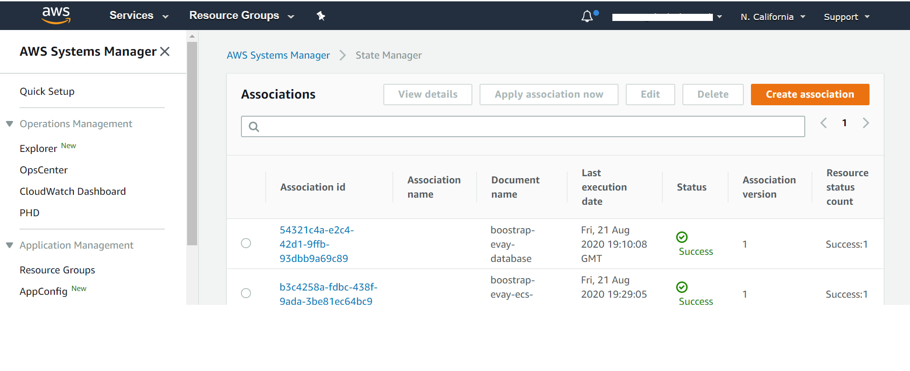

# Deploying Bento on AWS
This is the user documentation on provisioning bento on AWS.

[](https://www.codacy.com/gh/CBIIT/icdc-dataloader?utm_source=github.com&amp;utm_medium=referral&amp;utm_content=CBIIT/icdc-dataloader&amp;utm_campaign=Badge_Grade)


## A. Introduction
The purpose of this guide is to provide instructions on how to provision and deploy Bento Framework on AWS cloud platform. This guide assumes that the Custodian has an operating account with Amazon Web Services
[Amazon Web Services](https://aws.amazon.com) and all the necessary administrator's IAM role and permissions in order to create cloud resources. 
### B. Disclaimer
AWS is a Pay As You Go provider, as result the use of this instruction may result in  usage charges. We're in no way responsible for any charges incurred from resources created using this documentation.

All scripts related to this documentation can be found here: [Bento Custodian](https://github.com/CBIIT/bento-custodian)

## C. Architecture
The code in this demo will create the following resources via Terraform:

* A new VPC and subnets
* Application loadbalancer
* Bastion Host
* ECS cluster with one EC2 node
* Neo4j Database in private subnet



## D. Pre-requisites
Ensure you have the following tools installed and configured before proceeding. All instructions provided here assumes you have unix-like environment

#### a) AWS CLI
* Follow the instructions on official Amazon Web site to [install](https://docs.aws.amazon.com/cli/latest/userguide/install-cliv2.html) AWS CLI on your local machine using platform instruction applicable to you.

#### b) Configure AWS Credentials
Please ensure you have aws credential configured for your environment [aws credentials](https://docs.aws.amazon.com/cli/latest/userguide/cli-configure-files.html). This document does not make provision for access and secret keys due to unintended security reasons. 

#### c) Terraform
* Follow the instructions on the official [Terraform](https://learn.hashicorp.com/terraform/getting-started/install.html) site to install terraform on your local workstation using platform instruction applicable to you.

#### d) Git
* Follow the instructions on the official [Git](https://github.com/git-guides/install-git) site to install git on your local workstation.

### e) Ansible
* Use the instructions provided [here](https://docs.ansible.com/ansible/latest/installation_guide/intro_installation.html) to install **ansible** on your workstation


## E. Installations

#### a) Clone Bento Framework

* Clone  [Bento Framework](https://github.com/CBIIT/bento-custodian) to a working directory. In this guide, I will be using  **/tmp** as my working directory
    
```
bento@custodian: cd /tmp && git clone https://github.com/CBIIT/bento-custodian
```

* Change directory to the scripts location **bento-custodian/terraform/aws**

```
bento@custodian: cd bento-custodian/terraform/aws
```

#### b) Populate vars.tfvars file

*  Using your favorite text editor open and edit **${WORKING-DIRECTORY}/bento-custodian/terraform/aws/vars.tfvars** file. This is a variable file that will be used as input to the terraform. 
*  Please refer to **${WORKING-DIRECTORY}/bento-custodian/terraform/aws/variables.tf** file for full descriptions of each the variables listed in the vars.tfvars file. 
*  At minimum, you will need to provide appropriate values for the following;
	* 	profile - This is the name of the aws crendential profile you set above in step D.a
	*  region - This is the aws region you wish to provision your resources.
	

* Run **terraform init** 

```
bento@custodian:~$ terraform init
```

*  Run **terraform plan**. This command gives you insight into all the resources that will be created. Review the output and if satisfy continue to the next step

```
bento@custodian:~$ terraform plan -var-file=vars.tfvars
```

* Run **terraform apply** to provision your infrastructure for the bento framework

```
bento@custodian:~$ terraform apply -var-file=vars.tfvars -auto-approve
```

* At this point, if there are no errors your infrastructure will be provisioned. Note it will take about 10 minutes for the application to completely deployed.


```
Apply complete! Resources: 68 added, 0 changed, 0 destroyed.

Outputs:

admin_user = evay
bastion_host_ip = 12.13.14.15
custodian_api_endpoint = http://evay-alb-2073444928.us-east-1.elb.amazonaws.com/api/graphql/
custodian_url = http://evay-alb-2073444928.us-east-1.elb.amazonaws.com
```

### c) Monitor Deployment Progress

* Open [SSM](https://us-west-1.console.aws.amazon.com/systems-manager/home)
* Click [State Manager](https://us-west-1.console.aws.amazon.com/systems-manager/state-manager) in the left pane of the navigation
* You will see the current status of the deployment. If everything goes well the **status** should change from **Pending** to **Success** as shown below.




### d Verify Deployment
When the deployment is completed, navigate to the **custodian\_url\** to verify that the application is loaded successfully.

* Home page

* Cases Page

* Program Page


### e) Teardown
To destroy resouces created in this demo;

* Run **terraform destroy** to destroy the resources provisioned.

```
bento@custodian:~$ terraform destroy -var-file=vars.tfvars -auto-approve
```

## F. Application Updates
Many times, there are needs to customize Bento Framework based on your unique needs or some requirements, to make updates to the existing resources, it is recommended to fork both frontend and backend repositories used in this demo - that is [backend](https://github.com/CBIIT/bento-demo-backend) and [frontend](https://github.com/CBIIT/bento-demo-frontend). Follow below steps to apply any changes made to either backend or frontend codes.

### a) Edit  vars.tfvars file
*  Using your favorite text editor open and edit **${WORKING-DIRECTORY}/bento-custodian/terraform/aws/vars.tfvars** file.
*  Replace the values of backend_repo and frontend_repo with the new url of your forked repositories as shown below; 


### b) Apply changes to terraform state

* Run **terraform apply**

```
bento@custodian:~$ terraform apply -var-file=vars.tfvars -auto-approve
```

### c) Apply Changes using Ansible
* From the current working location change directory to **${WORKING-DIRECTORY}/bento-custodian/terraform/aws/ansible**

```
bento@custodian:~$ cd ansible
```

* Run **ansible-playbook update-custodian.yml** to deploy changes committed to git repository. Note, if you wish to apply updates using git tags, edit **${WORKING-DIRECTORY}/bento-custodian/terraform/aws/ansible/vars.yaml** file by supplying appopriate tag values to:
	* frontend_tag - git tag for forked frontend repository
	* backend_tag - git tag for forked backend repository
* It is also recommended to change docker tag (**image_tag**) in between changes.

```
bento@custodian:~$ ansible-playbook update-custodian.yml
```


## G. Data Model Updates

### a) Edit  vars.tfvars file
*  Using your favorite text editor open and edit **${WORKING-DIRECTORY}/bento-custodian/terraform/aws/vars.tfvars** file.
*  Replace the values of data_repo with the new url of your forked data-model repository.

### b) Apply changes to terraform state

* Run **terraform apply**

```
bento@custodian:~$ terraform apply -var-file=vars.tfvars -auto-approve
```
### c) Apply Changes using Ansible
* From the current working location change directory to **${WORKING-DIRECTORY}/bento-custodian/terraform/aws/ansible**

```
bento@custodian:~$ cd ansible
```

* Run **ansible-playbook update-db.yml** to load data to neo4j database from changes committed to data model repository. Note, if you wish to apply updates using git tags, edit **${WORKING-DIRECTORY}/bento-custodian/terraform/aws/ansible/vars.yaml** file by supplying appopriate tag value to:
	* data_tag - git tag for forked data model repository
* You may optionally change the values of **model_file_name**, **dataset** and **properties_file_name** if those files have been modified and the files renamed from default.
* Details notes are given in **${WORKING-DIRECTORY}/bento-custodian/terraform/aws/ansible/vars.yaml** as to what each parameter represents

```
bento@custodian:~$ ansible-playbook update-db.yml
```
