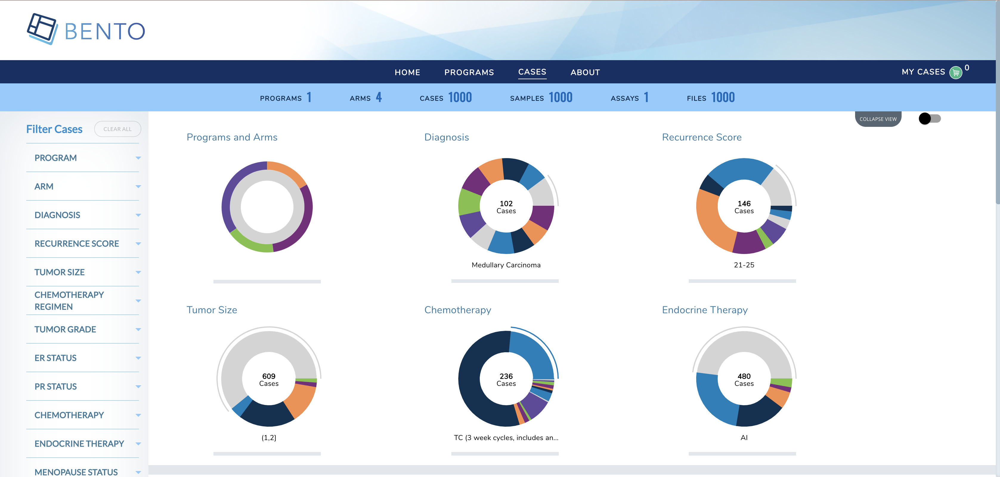
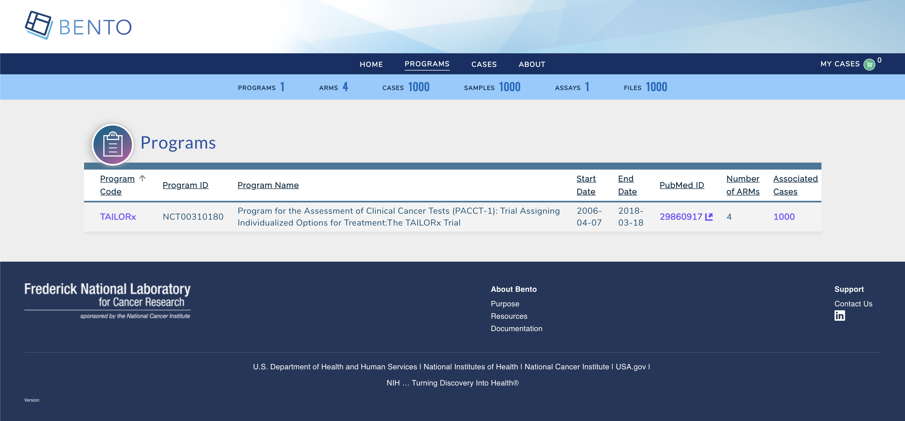
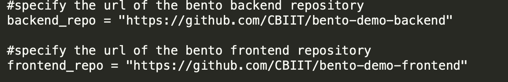

# Deploying Bento on GCP Cloud Run
This is the user documentation on provisioning bento on AWS.

[](https://www.codacy.com/gh/CBIIT/icdc-dataloader?utm_source=github.com&amp;utm_medium=referral&amp;utm_content=CBIIT/icdc-dataloader&amp;utm_campaign=Badge_Grade)


## A. Introduction
The purpose of this guide is to provide instructions on how to provision and deploy Bento Framework on GCP using Serverless Service. This guide assumes that the Custodian has an operating account with Google Cloud Platform.

### B. Disclaimer
GCP is a Pay As You Go provider, as result the use of this instruction may result in  usage charges. We're in no way responsible for any charges incurred from resources created using this documentation.

All scripts related to this documentation can be found here: [Bento Custodian](https://github.com/CBIIT/bento-cloudrun)

## C. Architecture
The code in this demo will create the following resources via Terraform:

* A new VPC and new VPC subnets
* A Cloud NAT router for egress access from the VPC subnets
* A GCE Instance serving as a Bastion Host
* A Private GKE Cluster with two nodes running two services - frontend and backend
* Neo4j Database in private subnets


## D. Pre-requisites
Ensure that you have the following tools installed before continuing.

* [Terraform](https://learn.hashicorp.com/terraform/getting-started/install.html#install-terraform)
* [gcloud](https://cloud.google.com/sdk/install)
* [GCP Project](https://cloud.google.com/appengine/docs/standard/nodejs/building-app/creating-project)
* [Ansible](https://docs.ansible.com/ansible/latest/installation_guide/intro_installation.html)

## E. Installations
#### a) Clone Bento Framework

* Clone  [Bento Framework](https://github.com/CBIIT/bento-custodian) to a working directory. In this guide, I will be using  **/tmp** as my working directory

    
```
bento@custodian: cd /tmp && git clone https://github.com/CBIIT/bento-custodian
```

* Change directory to cloudrun workspace

```
bento@custodian:~$ cd bento-custodian/terraform/cloudrun
```
#### b) Setup GCP Environment

* Login to your GCP account 

```
bento@custodian:~$ gcloud auth login
```

* Create google project. The name of the project can be anything you want or you may run **gcloud config set project PROJECT_NAME** to use existing project where **PROJECT_NAME** is the name of your project. 

```
bento@custodian:~$ gcloud projects create PROJECT_NAME
```

* Configure gcloud to use the newly created project or you use existing one.

```
bento@custodian:~$ gcloud config set project PROJECT_NAME
```

* Create service account. Note you can name it anything you want, in this example I am calling it bento-sa

```
bento@custodian:~$ gcloud iam service-accounts create SERVICE_ACCOUNT
```

* List and copy the email address of the service account **SERVICE_ACCOUNT_EMAIL**

```
bento@custodian:~$ gcloud iam service-accounts list
NAME  EMAIL                                               DISABLED
      bento-sa@bento-cloudrun.iam.gserviceaccount.com  False
```

* Create a credential key for the service account. Note the name of the file can be anything but ensure it ends with **.json**. Google allows other file formats but in this example I will be using json format.

```
bento@custodian:~$ gcloud iam service-accounts keys create gcloud_api_key.json --iam-account=SERVICE_ACCOUNT_EMAIL
```

* Get your Billing **ACCOUNT_ID**

```
bento@custodian:~$ gcloud beta billing accounts list
ACCOUNT_ID            NAME                OPEN  MASTER_ACCOUNT_ID
01T111-K20X0C-Y00000  My Billing Account  True
```

* Link your project to Billing account

```
bento@custodian:~$ gcloud beta billing projects link PROJECT_NAME --billing-account ACCOUNT_ID
```

* Enable google cloud services apis

```
bento@custodian:$ gcloud services enable cloudresourcemanager.googleapis.com
bento@custodian:$ gcloud services enable iam.googleapis.com
bento@custodian:$ gcloud services enable cloudbilling.googleapis.com
bento@custodian:$ gcloud services enable compute.googleapis.com
bento@custodian:$ gcloud services enable run.googleapis.com
bento@custodian:$ gcloud services enable vpcaccess.googleapis.com
```

* Grant IAM roles to the service account

```
bento@custodian:$ gcloud projects add-iam-policy-binding  PROJECT_NAME --member serviceAccount:SERVICE_ACCOUNT_EMAIL --role roles/owner

```
#### c) Populate vars.tfvars file
*  Using your favorite text editor open and edit **${WORKING-DIRECTORY}/bento-custodian/terraform/cloudrun/vars.tfvars** file. This is a variable file that will be used as input to the terraform. 
*  Please refer to **${WORKING-DIRECTORY}/bento-custodian/terraform/cloudrun/variables.tf** file for full descriptions of each the variables listed in the vars.tfvars file.  At minimum you will need to provide value to the following.
    * gcp_auth\_file = name of the service account key generated earlier
    * gcp_region = gcp region to use for this deployment
    * gcp_project = name of the gcp project created earlier
    * stack_name = can be anything
    * service_account\_id = name of the service account created earlier

#### d) Deploy Application
   
* Run **terraform init** 

```
bento@custodian:~$ terraform init
```

*  Run **terraform plan**. This command gives you insight into all the resources that will be created. Review the output and if satisfy continue to the next step

```
bento@custodian:~$ terraform plan -var-file=vars.tfvars
```

* Review the output of the above command. It will show all the resources to be created.
* Run **terraform apply** to provision your Bento environment

```
bento@custodian:~$ terraform apply -var-file=vars.tfvars -auto-approve
```

*  At this point, if there are no errors your infrastructure will be provisioned. Note it will take about 10 minutes for the application to completely deployed.

```
Outputs:

backend_url = https://bento-cloudrun-backend-rxpxr4ih3q-uk.a.run.app
bastion_host_private_ip = 172.16.1.2
bastion_host_public_ip = 34.86.56.119
db_private_ip = 192.168.5.2
frontend_url = https://bento-cloudrun-frontend-rxpxr4ih3q-uk.a.run.app
service_id = bento-sa@bento-cloudrun.iam.gserviceaccount.com
```
	 
### e) Verify Deployment
When the deployment is completed, navigate to the **frontend\_url\** to verify that the application is loaded successfully.

* Home page

* Cases Page

* Program Page



### f) Teardown
To destroy resouces created in this demo;

* Run **terraform destroy** to destroy the resources provisioned.

```
bento@custodian:~$ terraform destroy -var-file=vars.tfvars -auto-approve
```

## F. Application Updates
Many times, there are needs to customize Bento Framework based on your unique needs or some requirements, to make updates to the existing resources, it is recommended to fork both frontend and backend repositories used in this demo - that is [backend](https://github.com/CBIIT/bento-demo-backend) and [frontend](https://github.com/CBIIT/bento-demo-frontend). Follow below steps to apply any changes made to either backend or frontend codes.

### a) Edit  vars.tfvars file
*  Using your favorite text editor open and edit **${WORKING-DIRECTORY}/bento-custodian/terraform/cloudrun/vars.tfvars** file.
*  Replace the values of backend_repo and frontend_repo with the new url of your forked repositories as shown below; 



### b) Apply changes to terraform state

* Run **terraform apply**

```
bento@custodian:~$ terraform apply -var-file=vars.tfvars -auto-approve
```

### c) Apply Changes using Ansible
* From the current working location change directory to **${WORKING-DIRECTORY}/bento-custodian/terraform/cloudrun/ansible**

```
bento@custodian:~$ cd ansible
```

* Run **ansible-playbook update-custodian.yml** to deploy changes committed to git repository. Note, if you wish to apply updates using git tags, edit **${WORKING-DIRECTORY}/bento-custodian/terraform/cloudrun/ansible/vars.yaml** file by supplying appopriate tag values to:
	* frontend_tag - git tag for forked frontend repository
	* backend_tag - git tag for forked backend repository
* It is also recommended to change docker tag (**image_tag**) in between changes.

```
bento@custodian:~$ ansible-playbook update-custodian.yml
```


## G. Data Model Updates

### a) Edit  vars.tfvars file
*  Using your favorite text editor open and edit **${WORKING-DIRECTORY}/bento-custodian/terraform/cloudrun/vars.tfvars** file.
*  Replace the values of data_repo with the new url of your forked data-model repository.

### b) Apply changes to terraform state

* Run **terraform apply**

```
bento@custodian:~$ terraform apply -var-file=vars.tfvars -auto-approve
```
### c) Apply Changes using Ansible
* From the current working location change directory to **${WORKING-DIRECTORY}/bento-custodian/terraform/cloudrun/ansible**

```
bento@custodian:~$ cd ansible
```

* Run **ansible-playbook update-db.yml** to load data to neo4j database from changes committed to data model repository. Note, if you wish to apply updates using git tags, edit **${WORKING-DIRECTORY}/bento-custodian/terraform/cloudrun/ansible/vars.yaml** file by supplying appopriate tag value to:
	* data_tag - git tag for forked data model repository
* You may optionally change the values of **model_file_name**, **dataset** and **properties_file_name** if those files have modified and the files renamed from default.

```
bento@custodian:~$ ansible-playbook update-db.yml	
