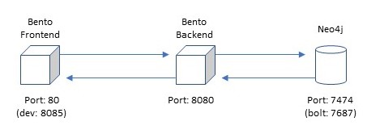
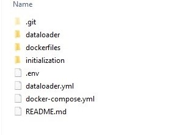
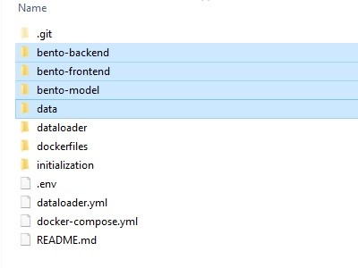

# Installing Bento on Your Local Machine

## Overview
The Bento-Local environment is designed to run directly within Docker on a user’s workstation. This allows users to create and deploy their local copy of Bento with minimal changes to their local environment and allows a configuration that can be used with different workstation operating systems. 

The Bento-Local project supports the following build modes:
* Demo:  this build mode will pull pre-configured frontend and backend Bento Docker containers to your local system and create a Neo4j database seeded with demo data. This mode is designed to allow users to quickly create a local installation of Bento for demonstration purposes.
* Build:  this build mode will create production ready frontend and backend Bento Docker containers. This mode requires users to have local copies of the bento-frontend and bento-backend repositories configured as needed for the build. Note that when using build mode there are no changes made to the source code made during the build process, any changes or configurations made to the user's local copy of the source code will be reflected in the build.
* Dev:  this build mode will create Bento Docker containers suitable for local development. Note that in this mode configuration changes will be made during the build process to use Bento-Local resources and the frontend website will reflect any changes made in the user's local copy of the source code live. The frontend container in this mode will run on port 8085 and will require including this port in the  URL.

All local copies of source code and configuration files used for your environment must reside within the root of the Bento-Local project folder. For example, copies of the Bento source code must be located at *bento-local/[source folder]*.


Bento-local consists of three components hosted within Docker containers and a separate Dataloader container that will run the Bento dataloader scripts. Depending on configuration options the build can take several minutes. When the build is complete the Bento components will be configured as follows:



**Front End:**

* Local URL:	http://localhost/
* Local URL (dev mode):	http://localhost:8085/
* The Frontend container will make requests to the backend over port 8080. This container is built using a local checkout of the bento-frontend repository.

**Back End:**

* Local URL:	http://localhost:8080/
* The Backend container will make requests to Neo4j over port 7474 and pass requested data to the Frontend. This container is built using a local checkout of the bento-backend repository.

**Neo4j:**

* Local URL:	http://localhost:7474/
* The Neo4j container holds the graph database for the Bento system and will return data to the Backend when requested.
* NOTE: The Bento-Local Neo4j container will always be created with an empty database. In order to use the Bento-Local environment with this database a dataset will need to be populated using the Bento-Local Dataloader.

**Dataloader:**

* The Dataloader container will load a local data set into the graph database hosted within the Neo4j container. This component requires local copies of the bento-backend and bento-model repositories as well as a local copy of the data to be loaded. This container will not continue running after data has been loaded.

## Docker
The official Docker documentation can be found [here](https://docs.docker.com/get-started/). If you've never used Docker before it may be helpful to read some of the Docker documentation to familiarize yourself with containers.

To install Docker choose from the following options:

**Install Docker Desktop:**

Docker Desktop is an application for MacOS and Windows machines for the building and sharing of containerized applications and microservices. It can be downloaded [here](https://www.docker.com/products/docker-desktop).

Once Docker Desktop has been installed docker commands can be run from Powershell or terminal windows.

**Install Docker Engine:**

Instructions for installing Docker Engine can be found [here](https://docs.docker.com/engine/install/).

If choosing this option docker-compose will need to be installed separately. Instructions for installing docker-compose can be found [here](https://docs.docker.com/compose/install/).


## Installing Bento

After installing Docker perform the following tasks from the command line to finish setting up Bento:

### Get the Bento-local scripts

The bento-local scripts can be found in Github at: [https://github.com/CBIIT/bento-local](https://github.com/CBIIT/bento-local) NOTE: these scripts are available on the master branch

You can clone this repository onto your local workstation using any git client you have installed to get the Bento-Local scripts:




### Initialize your bento-local project

Bento-Local includes initialization scripts that will prepare your local environment to build. Note that for all build types other than "demo" it is required to initialize the bento-local environment. The initialization scripts will checkout all of the required Bento source code and include demo data to use if desired. After running the initialization script return to the root of your Bento-Local environment and you will be ready to build your project.

Initialization scripts are avilable for Mac/Linux or Windows (either powershell or command line) platforms within the initialization folder. To initialize your local environment please choose and run one of the available scripts from the initialization folder.

Details for the initialization script can be found in the README file in bento-local/initialization. Note that for modes other than "dev_mode" building bento-local will require updates to configuration files. Initializing your bento-local project will create the following additional folders:

* bento-frontend: cloned from https://github.com/CBIIT/bento-frontend.git
* bento-backend: cloned from https://github.com/CBIIT/bento-backend.git
* bento-model: cloned from https://github.com/CBIIT/bento-model.git
* data: a copy of the included demo data



Note that the bento-local build will use the actual code you have cloned locally when it builds - if you require features from a specific branch you must clone that branch specifically using git or by updating the defaults used in the initializion script. For a vanilla install of Bento the default branches will be sufficient.

### Configure Environment settings for your local instance

The bento-local build and initialization scripts use configuration options defined in the `.env` file that is included within the bento-local project. This file contains default values to use when building Bento-Local, it is possible to use the default settings to build Bento-Local in "dev" mode. The configurations can be changed as needed, however please note that the username for new Neo4j containers should always remain "neo4j". The default values for this file are:

```
########################################
#                                      #
#      INITIALIZATION PROPERTIES       #
#                                      #
########################################

USE_DEMO_DATA=yes
# Set to "yes" to seed the project with the provided demo data set

BACKEND_BRANCH=master
FRONTEND_BRANCH=master
MODEL_BRANCH=bento_core_data_model_tailorx_extension
# Set these variables to the desired branches to use when initializing the project with Bento source code

########################################
#                                      #
#          RUNTIME PROPERTIES          #
#                                      #
########################################

BUILD_MODE=build
# Defines the build type used when building the project. Available options are:  build, dev

FRONTEND_SOURCE_FOLDER=bento-frontend
# Set to your local copy of the frontend code - the default value for this is "bento-frontend". NOTE: this folder MUST be located within the folder specific to the project you are building

BACKEND_SOURCE_FOLDER=bento-backend
# Set to your local copy of the backend code - the default value for this is "bento-backend". NOTE: this folder MUST be located within the folder specific to the project you are building

BENTO_DATA_MODEL=bento-model
# Set to your local copy of the Bento data model - the default value for this is "bento-model". NOTE: this folder MUST be located within the folder specific to the project you are building

NEO4J_USER=neo4j
# The user name to set for Neo4j - this should remain as the default value of "neo4j" for local neo4j containers

NEO4J_PASS=neo4j_pass
# The password to set for Neo4j. This can be changed if desired
```

Note that the locations of the FRONTEND_SOURCE_FOLDER, BACKEND_SOURCE_FOLDER, and BENTO_DATA_MODEL are important. These values are relative paths and must be within the root of the Bento-Local project.

### Run the Bento-local Environment

***docker-compose environment variables:***

The docker-compose files for bento-local have been written to make use of Buildkit and the Docker CLI. The commands used for docker-compose should set these options as active by passing environment variables as:

* Windows: ```$Env:COMPOSE_DOCKER_CLI_BUILD=1; $Env:DOCKER_BUILDKIT=1;```

* Linux/Mac: ```COMPOSE_DOCKER_CLI_BUILD=1 DOCKER_BUILDKIT=1```

Many of the commands listed in this document will need to be appended to this variable declaration. Choose the correct command for the system you are running on.

### Running Bento-local services
NOTE: all commands must be run from within the root of the Bento-Local project.

To build the bento-local infrastructure and start all containers:

	* Windows:    $Env:COMPOSE_DOCKER_CLI_BUILD=1; $Env:DOCKER_BUILDKIT=1; docker-compose up -d
	* Linux/Mac:  COMPOSE_DOCKER_CLI_BUILD=1 DOCKER_BUILDKIT=1 docker-compose up -d
	
Once all Bento-Local containers are running Bento can be accessed from a browser at the frontend URL listed in the [Overview](#overview)
	
**NOTE: When using Docker Desktop you will need to allow your local source folders to be shared with the docker containers. Docker Desktop should prompt for permission to share these folders when the containers are started.


To rebuild an individual container (NOTE: The available containers for this command are: bento-backend, bento-frontend, neo4j):

	* Windows:    $Env:COMPOSE_DOCKER_CLI_BUILD=1; $Env:DOCKER_BUILDKIT=1; docker-compose up -d --no-deps --build <service_name>
	* Linux/Mac:  COMPOSE_DOCKER_CLI_BUILD=1 DOCKER_BUILDKIT=1 docker-compose up -d --no-deps --build <service_name>
	
To stop all running bento-local containers:

	* Windows:    $Env:COMPOSE_DOCKER_CLI_BUILD=1; $Env:DOCKER_BUILDKIT=1; docker-compose down
	* Linux/Mac:  COMPOSE_DOCKER_CLI_BUILD=1 DOCKER_BUILDKIT=1 docker-compose down

To stop a single running container:

	* Windows:    $Env:COMPOSE_DOCKER_CLI_BUILD=1; $Env:DOCKER_BUILDKIT=1; docker-compose down <service_name>
	* Linux/Mac:  COMPOSE_DOCKER_CLI_BUILD=1 DOCKER_BUILDKIT=1 docker-compose down <service_name>
	
To attach a shell to a running container:

	docker exec -it <container name> /bin/bash   (use /bin/ash for frontend and backend containers as they are based on alpine)

### Changing the Bento-local build mode
To change the build mode of your Bento-Local project the following steps must be taken:

* Update the BUILD_MODE variable in the .env file: this should be changed to the desired mode

* Rebuild your bento containers - to rebuild your containers use the following command:

```
	* Windows:    $Env:COMPOSE_DOCKER_CLI_BUILD=1; $Env:DOCKER_BUILDKIT=1; docker-compose up -d --build
	* Linux/Mac:  COMPOSE_DOCKER_CLI_BUILD=1 DOCKER_BUILDKIT=1 docker-compose up -d --build
```

Taking these steps will rebuild the Bento-Local environment with the desired build mode. Note that rebuilding Bento-Local does not require reloading data.

### Cleaning your Bento-local project
The following commands can be used to remove the Docker cache and to return your system to a clean state. When running these commands only unused objects will be removed - if you want to fully remove all cached objects you will need to stop all running Docker containers by running "docker-compose down"

To clean docker objects for all stopped containers (this command can be used to return to a clean system and start over with new configurations):

	docker system prune -a

To clean all docker volumes (NOTE: this will remove any data loaded into Neo4j):

	docker system prune --volumes


### Running the Bento-local dataloader:
The Bento Dataloader allows a user to load locally stored data into the Bento database in Neo4j. If you are using the Bento demo data your data folder will be populated when your Bento-Local project is initialized. If you have a different data set to load you can replace the demo data and use the dataloader with that data set.

Note that the dataloader requires the following local resources, note that all of these are created by the bento-local initialization script:
* A local copy of the bento-backend source code. This will be used to supply schema files. The location of this folder must be within the root folder of the version of bento-local you are using and its location is set by the BACKEND_SOURCE_FOLDER variable in the .env file. This can be obtained by running the initialization script.
* A local copy of the bento-model source code. This will be used to supply data model files. The location of this folder must be within the root folder of the version of bento-local you are using and its location is set by the BENTO_DATA_MODEL variable in the .env file. The Bento data model can be found at:  https://github.com/CBIIT/bento-model.git.  This can be obtained by running the initialization script.
* A local copy of the data you intend to load. This data must be configured to match the Bento data model and schema and located in a folder named "data" within the bento-local project (ex. "bento-local/dev_mode/data").  A set of demo data can be obtained by running the initialization script.
* A properly configured copy of the dataloader configuration file located at dataloader/bento-local.yml. This file does not require any changes from the version in Github and will use the neo4j credentials and folder locations defined in the .env file.

To start the bento-dataloader container and load data:

	* Windows:    $Env:COMPOSE_DOCKER_CLI_BUILD=1; $Env:DOCKER_BUILDKIT=1; docker-compose -f dataloader.yml up --build bento-dataloader
	* Linux/Mac:  COMPOSE_DOCKER_CLI_BUILD=1 DOCKER_BUILDKIT=1 docker-compose -f dataloader.yml up --build bento-dataloader
