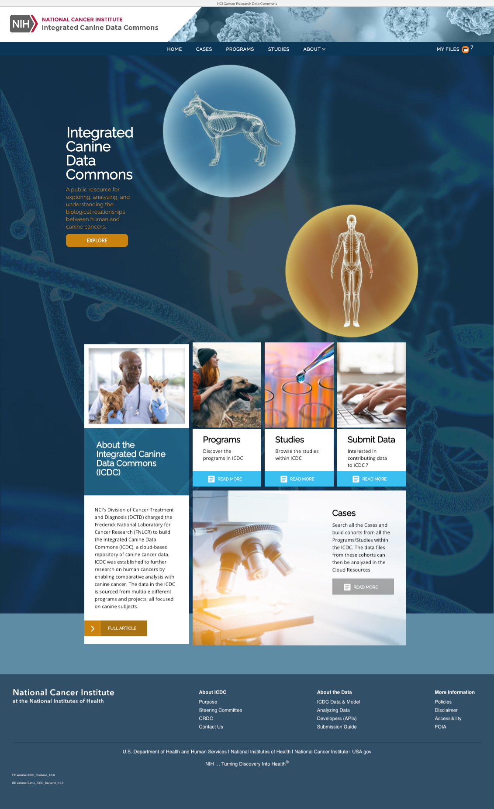

# Landing Page
## From Bento Landing page To ICDC Landing page.

**Bento Landing Page**

**ICDC  Landing Page** 

## Steps

**Hide Stats bar**

- config : set GET_LANDING_PAGE_DATA_QUERY to false
- config : set landingPageStatsBar to []
- code : [landingController.js] check GET_LANDING_PAGE_DATA_QUERY value. 
- code : add stats bar display control

**Copy ICDC landing Page code to overwrite BENTO landing page**

code : install package styled-components - npm install styled-components

**Udpate the style**
code : update content css margin-top to remove the whith space between nav and rest of content. 
code : update read more button position 

**add/update Custodian**

jumbotron section
- code : import Custodian data
- code : add callToActionTitle
- code : add callToActionDescription
- code : add callToActionLink
- code : add callToActionButtonText-
- config: Update callToActionTitle
- config: Update callToActionDescription
- config: Update callToActionLink
- config: Update callToActionButtonText
- config: remove landingPageHero
- config: set landingPageStatsBar = []-

about Section
- code: add landingPageData.tile1.alt
- code: add landingPageData.tile1.img
- code: add landingPageData.tile1.titleText
- code: add landingPageData.tile1.descriptionText
- code: add landingPageData.tile1.callToActionLink
- config: update landingPageData.tile1.alt
- config: update landingPageData.tile1.img
- config: update landingPageData.tile1.titleText
- config: update landingPageData.tile1.descriptionText
- config: update landingPageData.tile1.callToActionLink-

program Section
- code: add landingPageData.tile2.alt
- code: add landingPageData.tile2.img
- code: add landingPageData.tile2.titleText
- code: add landingPageData.tile2.descriptionText
- code: add landingPageData.tile2.callToActionLink
- config: update landingPageData.tile2.alt
- config: update landingPageData.tile2.img
- config: update landingPageData.tile2.titleText
- config: update landingPageData.tile2.descriptionText
- config: update landingPageData.tile2.callToActionLink-

study section
- code: add landingPageData.tile3.alt
- code: add landingPageData.tile3.img
- code: add landingPageData.tile3.titleText
- code: add landingPageData.tile3.descriptionText
- code: add landingPageData.tile3.callToActionLink
- config: update landingPageData.tile3.alt
- config: update landingPageData.tile3.img
- config: update landingPageData.tile3.titleText
- config: update landingPageData.tile3.descriptionText
- config: update landingPageData.tile3.callToActionLink-

submit data section
- code: add landingPageData.tile4.alt
- code: add landingPageData.tile4.img
- code: add landingPageData.tile4.titleText
- code: add landingPageData.tile4.descriptionText
- code: add landingPageData.tile4.callToActionLink
- config: update landingPageData.tile4.alt
- config: update landingPageData.tile4.img
- config: update landingPageData.tile4.titleText
- config: update landingPageData.tile4.descriptionText
- config: update landingPageData.tile4.callToActionLink-

cases section

- code: add landingPageData.tile5.alt
- code: add landingPageData.tile5.img
- code: add landingPageData.tile5.titleText
- code: add landingPageData.tile5.descriptionText
- code: add landingPageData.tile5.callToActionLink
- config: add&update landingPageData.tile5.alt
- config: add&update landingPageData.tile5.img
- config: add&update landingPageData.tile5.titleText
- config: add&update landingPageData.tile5.descriptionText
- config: add&update landingPageData.tile5.callToActionLink

updated 33 parts of configuration.

updated 35 parts of code. 

## Work Time Estimate: 

3 hours in total

- Planning : 0.5 hour
- Coding&Custodian : 2 hour
- Style Updating : 0
- documentation : 0.5 hour

